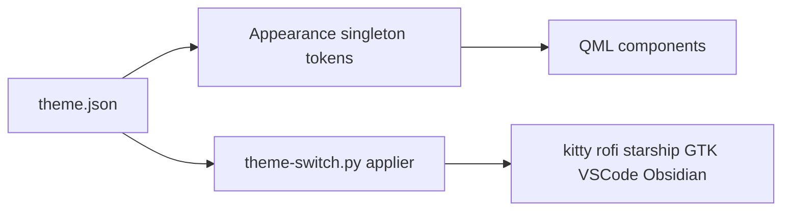

## adr_004_theme_system_qml_native_token_singleton_with_a_python_applier - Theme system: QML-native token singleton with a Python applier
> Date: 2026-08-20
> Status: Proposed
> Related request: (none yet)
> Related backlog: (none yet)
> Related task: (none yet)
> Drivers: The stack is QML-first, so it needs theming that binds natively yet still configures external apps.
> Reminder: Update status, linked refs, decision rationale, consequences, and follow-up work when you edit this doc.
> Indicators reviewed: 2026-09-03 16:43:14

# Overview
- Every QML component reads color tokens from an Appearance singleton; theme-switch.py writes out external-app config as a side effect.

# Context
- Considered but rejected HyDE's wallbash -> .dcol -> per-app template pipeline.
- Binding through a token singleton is the cleanest path for a QML-first stack.
- theme-switch.sh was rewritten to a thin entrypoint into theme-switch.py (Caelestia pattern).

# Decision
- Build a Commons/Appearance.qml singleton of color tokens read by every component.
- theme-switch.py writes external app configs (kitty, rofi, starship, GTK, VSCode, Obsidian) with atomic temp+rename writes, fcntl.flock to prevent stampedes, per-target try/except isolation, and {{key}} template substitution from theme.json.
- atomic_write calls path.resolve() before renaming so writing through a stow symlink preserves the link.

# Consequences
- Adding a new external-app target means editing the Python applier table.
- ~30ms Python startup vs bash, acceptable for an interactive switch.

# References
- Related request: (none yet)
- Related backlog: (none yet)
- Related task: (none yet)
