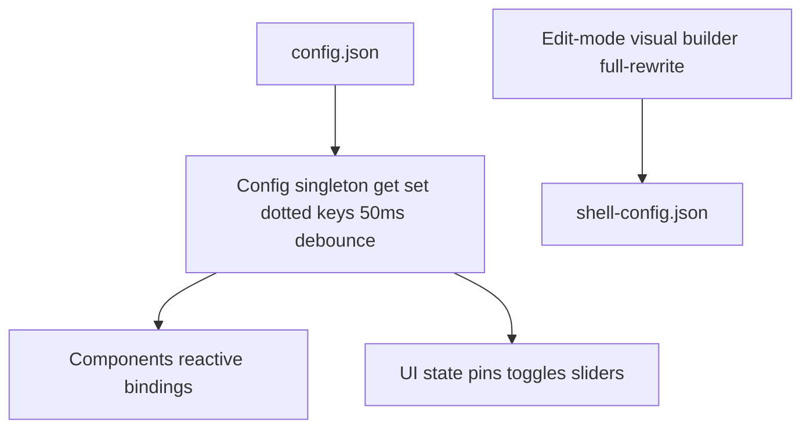

## adr_009_reactive_settings_persistence_config_singleton_jsonadapter_dotted_keys - Reactive settings persistence: Config singleton, JsonAdapter, dotted keys
> Date: 2026-08-20
> Status: Proposed
> Related request: (none yet)
> Related backlog: (none yet)
> Related task: (none yet)
> Drivers: Every setting must be reactive everywhere from a single source, and structural vs user-editable config must not mix.
> Reminder: Update status, linked refs, decision rationale, consequences, and follow-up work when you edit this doc.
> Indicators reviewed: 2026-09-03 16:43:15

# Overview
- A Config.qml singleton wraps one config JSON with get/set on dotted string paths, splitting per-user state from architectural config by layer.

# Context
- end-4 and DMS independently converged on the singleton + JsonAdapter + dotted-key pattern.
- Launcher pins first stored in shell-config.json — the wrong layer, since editing structural JSON from QML risks corruption.
- shell-config.json is architectural config (side types, widget zones, layout); Persistence.Config is user-editable UI state.

# Decision
- Central Config singleton wraps one JSON; components call Config.get/set with dotted paths, with a 50ms write-debounce.
- User-editable UI state (pins, toggles, sliders) lives in Persistence.Config (~/.config/archeotech/config.json), not shell-config.json.
- Edit-mode visual builder is the sole owner allowed to write shell-config.json, always full-rewriting from a deep clone (never partial-mutating).

# Consequences
- Keyed by string paths — typos surface at runtime, not compile-time.
- Edit-mode writes reuse the existing FileView hot-reload so the editor never touches live widget items.

# References
- Related request: (none yet)
- Related backlog: (none yet)
- Related task: (none yet)
