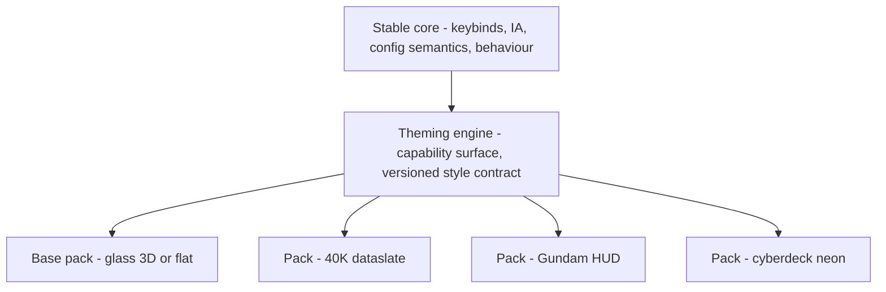

## adr_026_theming_architecture_skin_structure_boundary_and_versioned_capability_surface - Theming architecture: skin/structure boundary and versioned capability surface
> Date: 2026-08-21
> Status: Proposed
> Related request: (none yet)
> Related backlog: `item_021_theme_packs_official_community`
> Related task: (none yet)
> Drivers: deep user + community theming; distinct-identity traction; extensibility-first roadmap (ADR 021); keep the shell's behaviour stable across radically different looks.
> Reminder: Update status, linked refs, decision rationale, consequences, and follow-up work when you edit this doc.

# Overview
- Archeotech is a themeable-shell PLATFORM: a neutral glassmorphism BASE plus swappable, community-authorable identity PACKS. A pack may reskin the presentation layer as deeply as feasible, but may never mutate the interaction contract (keybinds, IA, config semantics, behaviour). "Everything visual can change; how it works stays put."

# Context
- Direction (owner, 2026-08-21): themes must go far beyond colour — decorative styling, shapes, fonts, FX, animations — and be authorable by the community, mirroring the widget-builder model. Yet Settings must stay familiar and keybinds/inner-workings must not change between packs.
- A single fixed identity under-serves both breadth (r/unixporn standard glass) and distinctiveness (WH40K/Gundam/cyberpunk hooks). See item_042 / item_080 (ricing + traction R&D).
- Existing rails this builds on rather than replaces: adr_004 (token singleton + Python applier), adr_010 (widget registry, filename convention + HolderRoot contract), adr_016 (external plugins load via file:// with injected appearance), adr_009 (reactive Config singleton, JSON adapter, dotted keys), adr_022 (per-instance widget config), adr_008 (high-opacity glass). Plugin cluster: item_063 (configSchema auto-forms + Manager pane), item_065 (install + plugins.json index), item_066 (manifest schema).

# Decision
- Adopt a **skin/structure boundary**. A theme pack is a kind of plugin (same install/discovery/manifest rails as widget plugins), loaded via the adr_016 file:// + injected-appearance mechanism.
- **Themeable capability surface (a pack MAY override):**
  1. Token tree — colour, radius, spacing, opacity, blur, elevation, type scale (extends adr_004).
  2. Type — font families/weights/casing/tracking.
  3. Shape language — corner treatment (rounded/clipped/ornate), borders, frame chrome (HUD brackets, parchment edges, filigree).
  4. Component style delegates — per-component visual variant behind a VERSIONED style contract; same props/slots/behaviour, different look.
  5. Decorator / FX layers — background textures, overlay shaders (scanlines, grain, parchment), glow/sheen.
  6. Motion — easing/duration tokens + optional per-component transition style.
  7. Assets — wallpaper, sigil/logo, iconography (sounds later).
  8. Lexicon (optional) — display-string flavour (codex/rite vs settings); display-only, never config keys.
  9. Pack-scoped settings — a pack MAY declare its own settings via configSchema, rendered through the standard ConfigForm pipeline (adr_009/item_063) in a consistent Theme section, persisted under a pack-namespaced key, shown only when the pack is active (the base's 3D/flat toggle is itself a base-pack setting).
- **Stable core (a pack may NOT touch):** keybinds + input handling; information architecture (which CORE settings exist, navigation, the <=2-keystroke rule, the Settings skeleton); widget mounting/registry contract, core config-key semantics, state model; component behaviour/props contract (no fake toggles); the security/perf sandbox. Packs ADD their own settings but do not rename/remove/relocate/rebind CORE ones.
- **Versioned style contract:** the component style-delegate surface is a public API gated by `minShellVersion` in the pack manifest (unify with item_066). Start the delegate surface CONSERVATIVE — ship tokens + shape + decorator + motion + assets + pack-settings first; add component-style delegates for a curated component set, expanding over time.
- **Trust tiers:** community packs run injected QML, so official/verified/community tiers + minShellVersion/deps gate distribution (item_066), surfaced in the Manager pane (item_063) and plugins.json index (item_065).

# Consequences
- Enables deep, community-authored identities (WH40K dataslate, Gundam-HUD, cyberdeck, later Star Wars/games) while guaranteeing familiar behaviour — the platform's core value + traction engine.
- One extensibility architecture serves two consumers (widgets + themes); theme distribution reuses the plugin rails (no parallel stack).
- Cost/risk: the style-delegate contract becomes a versioned public API — changing a component's style surface can break packs, so it must be documented and evolved conservatively; arbitrary community QML raises trust/perf concerns handled by the tier system.
- Follow-up work: item_081 (capability-surface engine), item_082 (flagship 40K pack + fallback), item_066 (extend manifest to packs), item_063/item_065 (Manager + index cover packs), item_051 (named personalities = lightweight token/shape presets on base). Base theme is formalised as the reference pack.

# References
- Related request: `req_000_archeotech_shell_dotfiles`
- Related backlog: `item_021_theme_packs_official_community`, `item_081_theming_capability_surface_engine_token_tree_component_style_registry_decorator_fx_motion_hooks_pack_scoped_settings`, `item_082_flagship_theme_pack_1_wh40k_shadow_spears_dataslate`
- Related task: `task_001_orchestrate_archeotech_shell_delivery`
- Builds on: adr_004, adr_008, adr_009, adr_010, adr_016, adr_021, adr_022
