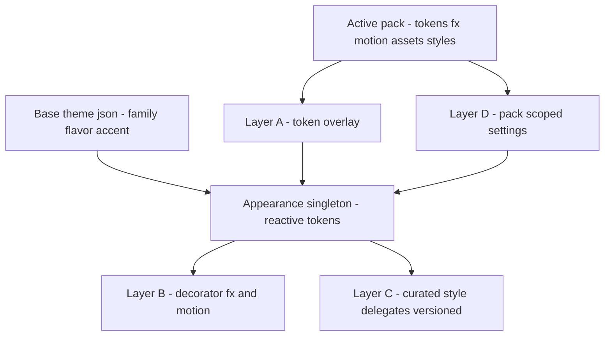

## adr_027_theming_engine_mechanism_pack_token_overlay_additive_fx_motion_curated_versioned_style_delegate_contract - Theming engine mechanism: pack token overlay, additive FX/motion, curated versioned style-delegate contract
> Date: 2026-08-21
> Status: Proposed
> Related request: (none yet)
> Related backlog: `item_081_theming_capability_surface_engine_token_tree_component_style_registry_decorator_fx_motion_hooks_pack_scoped_settings`
> Related task: `task_011_style_delegate_registry_decorator_fx_motion_tokens_pack_scoped_settings_remaining`
> Drivers: deliver adr_026's capability surface WITHOUT a big-bang component rewrite; preserve the reactive singleton binding chain (adr_004); reuse the plugin rails (adr_010/016/066/item_063); keep the versioned style API small and evolvable.
> Reminder: Update status, linked refs, decision rationale, consequences, and follow-up work when you edit this doc.

# Overview
- The theming engine ships as additive LAYERS over the existing reactive `Appearance` singleton, staged conservatively per adr_026: (A) a pack TOKEN OVERLAY that reskins the whole shell with near-zero component edits; (B) additive DECORATOR/FX + MOTION overlays at a few chrome mount points; (C) a small, `minShellVersion`-gated component STYLE-DELEGATE contract added LAST; (D) pack-scoped settings via the existing ConfigForm pipeline. It explicitly rejects routing every component through a new style-registry lookup.

# Context
- Note: every code path/symbol cited below lives in the sibling `archeotech-shell` repo (the shell was split out 2026-07-09); the Logics validator only sees this dotfiles repo, so those citations read as "missing" here — expected, not stale.
- Current state (seam analysis 2026-08-21): all ~20 primitives and 100+ call sites read `Commons.Appearance.*` DIRECTLY and reactively (`Commons/Primitives/GlassButton.qml`, `SegmentedControl.qml`, `StateLayer.qml`, `Modules/Dashboard/panels/DashCard.qml`, etc.). The ONLY existing style-variation seam is `flatMode`/`shadowStrength` (`Commons/Appearance.qml:9-19` + ~15 multiplier sites).
- Theme-apply path: `scripts/theme-switch.py` writes `~/.config/archeotech/theme.json` → a `FileView` reloads `_data` → token properties re-bind → components repaint with no manual invalidation (`Commons/Appearance.qml:20-62`). Plugins can't `import Commons`, so they receive the LIVE `Appearance` singleton via an injected `property var appearance` (`Modules/Shell/Sides/WidgetLoader.qml:60-61`, `Modules/Shell/Panels/PanelHost.qml:78-80`). A pack is a plugin (adr_026) with its own dir + manifest (adr_016/066).
- Rejected alternative: a `StyleRegistry.style(componentId, variant)` that every component reads through. It is a 100+ site invasive refactor, makes the ENTIRE component surface a versioned public API on day one (maximum breakage blast radius — the risk adr_026 explicitly names), and re-implements the reactive overlay the singleton already gives for free.

# Decision
- **Layer A — Pack token overlay (backbone).** `Appearance` gains `activePack` (persisted via Config, adr_009) and a reactive merge: for every token, pack override wins → else base `theme.json` value → else hardcoded fallback. Implemented AT THE SINGLETON so the existing binding chain repaints everything with zero component edits. A pack ships its own dir under `$XDG_DATA_HOME` — `~/.local/share/archeotech/packs/<id>/` (beside modules, per XDG + freedesktop data conventions; NOT `~/.config`) — containing `pack.json` (extends item_066 manifest: id, name, tier, `minShellVersion`, optional `inherits` = a parent pack id for icon-theme-style inheritance) + `tokens.json` (colour, radius, spacing, opacity, blur, elevation, shape, type scale, motion). Base `theme.json` stays the family/flavour/accent base; pack tokens overlay it — NOT crammed into global `theme.json`. Ship the current glass look as the reference `base` pack.
- **Layer B — Decorator/FX + motion (additive).** Decorator/FX are ADDITIVE overlay items (background texture/shader, glow/sheen, frame chrome: HUD brackets / parchment edges) mounted at a SMALL set of chrome points (`FrameBackground`, panel shells, bar frame) — never per-widget. Gated by the active pack + a global on/off; no pack ⇒ no overlay (base unchanged). Motion: a pack overrides the `Appearance.anim`/`curve` token sets (`Commons/Appearance.qml:216-260`); components already read these, so motion reskins globally for free. Mirror the existing `PanelShadow`/`StateLayer` attachment pattern.
- **Layer C — Curated versioned style-delegate contract (LAST, small).** Only for packs that must change component STRUCTURE beyond tokens. A CURATED set (start ≈6 load-bearing: `GlassButton`, `DashCard`, `SegmentedControl`, `BarPill`, `PanelShadow`, one form Row) gains a delegate seam: the component keeps its behaviour/props/slots (the STABLE contract) and delegates only its VISUAL to a pack-supplied QML resolved by FILENAME CONVENTION (adr_010 pattern): `<packDir>/styles/<ComponentId>.qml`, falling back to the base delegate when omitted. The delegate's received props/slots ARE the versioned public API, gated by `minShellVersion`. Keep the set small; expand deliberately; document each in a new `docs/STYLE_API.md`.
- **Layer D — Pack-scoped settings.** A pack MAY declare `configSchema`, rendered through the EXISTING `ConfigForm` pipeline (item_063, shipped) in a Theme section, persisted under pack-namespaced Config keys (`packs.<id>.*` — reuse the reactive Config, adr_009 dotted keys; no new persistence singleton), shown only when the pack is active. The base pack's 3D/flat toggle becomes a base-pack setting. Lexicon (adr_026 cat 8) deferred.
- **Boundary (unchanged from adr_026):** packs never touch keybinds, IA, config-key semantics, or component behaviour — they only ADD their own settings.

# Consequences
- Layer A alone delivers most of a pack's identity (tokens + shape + type + motion + assets) with near-zero component churn and full reactive repaint — the fast path to a visible flagship (item_082 can start after Wave 1).
- The versioned public API (Layer C) stays small and lands LAST, minimising the "changing a component breaks packs" blast radius adr_026 flags.
- Reuses every existing rail: reactive singleton (adr_004), injected appearance (adr_016), filename-convention registry (adr_010), configSchema→ConfigForm (item_063), manifest + tiers (item_066).
- Cost: the overlay adds a per-lookup merge in `Appearance` — mitigate by caching the merged token set on `activePack` change, not per component read.
- Risk: two token sources (base `theme.json` + pack `tokens.json`) need a crisp precedence/fallback story or packs silently miss tokens — document + lint it. Layer C runs pack-authored QML, so trust tiers (item_066) + `minShellVersion` gating are mandatory before community packs.
- Build order (waves): Wave 1 Layer A + base pack → Wave 2 Layer B → Wave 3 Layer C + `STYLE_API.md` → Wave 4 Layer D.
- Linux theming conventions: aligns with XDG base dirs (packs under `$XDG_DATA_HOME`), freedesktop icon-theme inheritance-with-fallback (pack `inherits` + override›base›fallback precedence), Material-3 design-token layering (already in the token tree), data-driven themes for Layers A/B (base16/pywal/Stylix-style), and live reactive reload. Divergence: Layer C ships QML (no CSS layer in a QML shell) — mitigated by trust tiers + `minShellVersion` + base-delegate fallback, and deferred to last.

# References
- Related request: `req_001_theming_capability_surface_flagship_identity_packs`
- Related backlog: `item_081_theming_capability_surface_engine_token_tree_component_style_registry_decorator_fx_motion_hooks_pack_scoped_settings`
- Related task: `task_011_style_delegate_registry_decorator_fx_motion_tokens_pack_scoped_settings_remaining`
- Builds on: adr_026 (skin/structure boundary + capability surface), adr_004 (token singleton + Python applier), adr_010 (filename-convention registry), adr_016 (injected appearance), adr_009 (reactive Config), item_063 (ConfigForm), item_066 (manifest/tiers)
