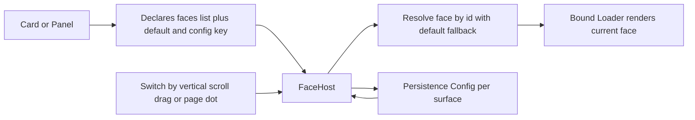

## adr_030_swappable_widget_panel_faces_via_shared_facehost - Swappable widget/panel faces via shared FaceHost
> Date: 2026-09-10
> Status: Accepted
> Related request: `req_003_swappable_widget_faces_and_skins`
> Related backlog: `item_100_swappable_widget_faces_and_skins`
> Related task: `task_030_swappable_widget_faces_and_skins`
> Drivers: 0.26 exit signal "change a widget's LOOK, not just its presence" on large content surfaces where layout genuinely varies and per-instance config can't express it.
> Reminder: Update status, linked refs, decision rationale, consequences, and follow-up work when you edit this doc.
> Indicators reviewed: 2026-09-10 16:17:41

# Overview
- One reusable `FaceHost` gives any card or panel interchangeable **faces** (structurally different layouts over the same data), with switching, a carousel transition, and persistence — proven host-agnostic across a dashboard card (SystemStatus) and a panel (MediaPanel).

# Context
- Faces earn their keep only where the alternatives are different render TREES (SystemStatus gauges vs bars vs sparkline trend; MediaPanel full vs compact). A boolean/enum is config, not a face — a bar clock's 12/24h+seconds stayed config. Value was gated by a Wave-0 gauges spike before building the framework.
- The primary surface is the shell's LARGE surfaces (cards/panels), not bar icons (a ~28px strip can't host a meaningfully different look). Bar-widget faces were de-scoped.
- MangoWC is a scrolling compositor: it does **not** deliver horizontal two-finger scroll to a layer-shell surface (`angleDelta.x` is always 0; a side-swipe sends no event). Only the vertical axis arrives, and touchpads report `pixelDelta`, not `angleDelta` (learned earlier in `Widgets/Appearance/Carousel.qml`).
- Dashboard cards are fixed-height in the bento grid (can't shrink until item_046); panels control their own size via the strip's `size`/`axisSize`.

# Decision
- **Extract one `FaceHost`** (faces list + persistence + carousel + gestures + page-dots) and embed it in both `DashCard` and `MediaPanel`; faces read their data off an injected `host`/`card`. This is the literal proof of AC1's "host-agnostic" claim (−163 lines vs an inline copy per host).
- **Current face bound, outgoing snapshotted.** The visible `Loader.source` is BOUND to `face` (always correct, matches the page-dots); a throwaway second loader holds only the outgoing face during the slide. No imperative content juggling → no ordering races on rapid switches.
- **Switch via the vertical axis only** (two-finger scroll `pixelDelta.y` / mouse `angleDelta.y`, accumulate to a step) + click-drag + page-dot tap. Never rely on horizontal scroll.
- **Persist per surface** under `Persistence.Config` (`dashboard.faces.<title>`; `media.face`); restore on load; `_select` no-ops on unchanged id to guard stray writes.
- **Content-driven panel DEPTH via `implicitPerp`** (mirrors `implicitAxis`) so a compact face makes the panel genuinely shorter. Declared PER FACE (hardcoded like `implicitAxis`), never measured from a child layout — measuring collapsed the panel (measurement/binding loop). Gated so panels not exposing it keep the fixed `size` (no regression).
- **Panel padding cohesion**: standardise outer margin + inter-item gap on `spacing.xl` (16) across panels (the dashboard's rhythm) so no panel reads cramped.

# Consequences
- A new face = one self-contained `.qml` + a `faces` entry; no per-host plumbing. Documented in `docs/WIDGET_API.md` (FaceHost) + `docs/PANEL_API.md` (`implicitPerp`, padding).
- SystemStatus keeps a 1s visibility-gated poller + rolling history for the sparkline (in-memory, not persisted — matches reference shells, ANALYSIS §20).
- `compact` was dropped from SystemStatus (a fixed-height bento card can't shrink until item_046) but kept on MediaPanel (a panel can resize). Bar-widget faces remain unbuilt (secondary/low-value).
- Follow-ups: faces could declare their own size/constraints in the `faces` list (generalising `implicitAxis`/`implicitPerp`); bar-widget path if ever wanted; card-face persistence may fold into item_046's grid config.

# References
- Related request: `req_003_swappable_widget_faces_and_skins`
- Related backlog: `item_100_swappable_widget_faces_and_skins`
- Related task: `task_030_swappable_widget_faces_and_skins`
