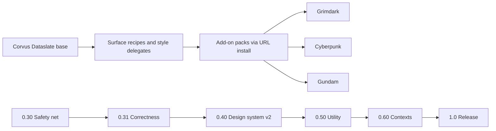

## adr_032_post_audit_direction_corvus_dataslate_base_add_on_identity_packs_contexts_as_1_0_headline - Post-audit direction: Corvus Dataslate base, add-on identity packs, Contexts as 1.0 headline
> Date: 2026-09-28
> Status: Accepted
> Related request: `req_005_2026_09_28_audit_upgrade_program`
> Related backlog: item_115_corvus_dataslate_base_identity
> Related task: task_031_orchestrate_2026_09_28_audit_upgrade_program
> Drivers: 2026-09-28 five-area audit and isolated render matrix; owner decisions the same day
> Reminder: Update status, linked refs, decision rationale, consequences, and follow-up work when you edit this doc.

# Overview
- The shell's base identity is Corvus Dataslate, identity packs are installable add-ons rather than built-ins, and Contexts is the 1.0 headline feature; delivery is re-sequenced safety net first.

# Context
- The 2026-09-28 audit (.claude/audits/2026-09-28/) rendered every theme x pack x mode x panel state in isolation and reviewed architecture, design, features, roadmap and tooling.
- Findings that force a direction: Grimdark chrome is hard-coded in core (72 frameChamfer branches in 20 files, copper/steel in base primitives), so a second identity pack would inherit copper; Angular renders almost identical to Base and HUD only recolours the accent; the base look drifted from STYLE_GUIDE (stealth, violet, restraint) toward copper; the daily-utility layer lags DMS/Noctalia/Caelestia while no peer has a developer context switcher; shot.sh ran the owner's autostart and could reach the live shell.

# Decision
- Base identity: Corvus Dataslate (obsidian with violet as the single live signal, tracked small-cap labels, proportional UI face with mono for data), delivered in item_115 on the design-system v2 foundation (items 110-114).
- Packs: Base is the only built-in pack. Grimdark (Warhammer), cyberpunk, gundam and future identities ship as add-ons through community pack support (item_021, item_065) after pack chrome moves out of core (item_112). Angular and HUD were test-only and become engine test fixtures (item_117); the HUD framing kit remains an opt-in engine capability (item_078).
- Headline: Contexts (item_122) is the 1.0 differentiator, with the dev radar (item_123) and Claude Ask (item_124) alongside.
- Sequencing: 0.30 safety net gates all shell code work; then correctness with a golden matrix, design system v2, utility layer, Contexts, 1.0. Personal machine config moves to road_002.

# Consequences
- The flagship Grimdark pack moves from "post-1.0 flagship" framing to "first add-on pack" in 1.1 and must be rebuilt on recipes; its current look is preserved as the acceptance reference.
- Every pack capability must be expressible through tokens, surface recipes and style delegates; any core branch on a pack id is a defect.
- 1.0 grows by about three weeks for Contexts; if it slips, Contexts is the first candidate to move to 1.1.
- Supersedes the roadmap framing in prod_001 that listed the flagship pack as a non-goal; prod_003 records the new product direction.

# References
- Related request: `req_005_2026_09_28_audit_upgrade_program`
- Related backlog: `item_112_surface_recipes_and_pack_chrome_out_of_core_primitives`, `item_115_corvus_dataslate_base_identity`, `item_117_retire_angular_and_hud_test_packs_to_test_fixtures`, `item_122_contexts_one_switch_for_project_cloud_and_workspace_state`
- Related task: `task_031_orchestrate_2026_09_28_audit_upgrade_program`
- Evidence: .claude/audits/2026-09-28/
