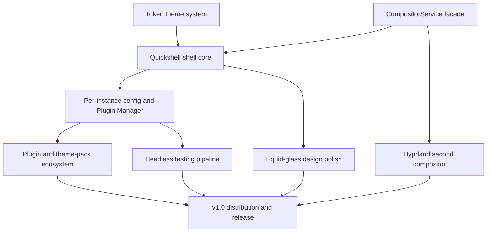

## prod_001_archeotech_shell - Archeotech shell
> Date: 2026-08-20
> Status: Proposed
> Related request: `req_000_archeotech_shell_dotfiles`
> Related backlog: `item_001_test_the_auto_day_night_schedule_end_to_end`, `item_002_visual_pass_on_the_light_themes`, `item_003_verify_vscode_colorcustomizations_regen_on_non_catppuccin_themes`, `item_004_check_widened_settings_panes_760_940_don_t_look_sparse`, `item_005_fix_dock_undock_freeze_wlroots_output_hotplug_on_mangowm_0_16`, `item_006_live_colour_preview_on_scroll_in_pickers`, `item_007_async_fade_in_on_wallpaper_thumbnails`, `item_008_eager_warm_the_wallpapers_service_at_shell_startup`, `item_009_palette_crossfade_on_theme_apply`, `item_010_move_thumbnail_cache_to_freedesktop_shared_path`, `item_011_decide_and_apply_lid_close_while_docked_suspend_behaviour`, `item_012_flat_glass_aesthetic_settings_toggle_full_rollout`, `item_013_layout_loadouts_presets`, `item_014_tiling_layout_picker_deferred_nice_to_haves`, `item_015_auto_hide_sides_in_fullscreen`, `item_016_launcher_keyboard_first_master_search`, `item_017_panel_keybinds_dismissal_consistency`, `item_018_lock_screen_customization_widgets_settings_pane`, `item_019_theme_applier_plugins_refactor`, `item_020_core_plugin_optional_extraction`, `item_021_theme_packs_official_community`, `item_022_visual_builder_drag_and_drop_spatial_zone_representation`, `item_023_dev_workflow_bar_widgets_docker_keyboardlayout_capslock`, `item_024_dev_workflow_rofi_scripts_aws_terraform_vscode_monitor`, `item_025_clipboard_improvements`, `item_026_multi_monitor_compositor_utilities`, `item_027_named_scratchpads`, `item_028_tool_discovery_system`, `item_029_quick_tools_context_menu_super_x`, `item_030_screenshot_recording_improvements`, `item_031_kitty_session_presets`, `item_032_ssh_quick_connect_super_ctrl_s`, `item_033_per_workspace_wallpapers`, `item_034_portability_machine_profiles`, `item_035_coherency_audit_slice_2_selector_unification_remaining`, `item_036_coherency_audit_slice_3_flat_mode_sweep`, `item_037_coherency_audit_slice_4_dedup_inputs`, `item_038_coherency_audit_slice_5_one_offs_tokens`, `item_039_glass_themed_system_tray_context_menu_tooltip`, `item_040_demo_onboarding_mode`, `item_041_r_d_missing_common_niche_shell_os_features`, `item_042_r_d_r_unixporn_ricing_inspiration_pass`, `item_043_fix_dashboard_auto_close_right_after_boot`, `item_044_workspace_indicators_3d_polish`, `item_045_edit_mode_stragglers_onto_3d_glass_theme`, `item_046_dashboard_customizable_grid`, `item_047_dashboard_pinnable_projects`, `item_048_dashboard_hero_rotating_quote`, `item_049_dashboard_customizable_system_notes_data_reliability`, `item_050_gradient_sheen_on_nested_cards_experiment`, `item_051_named_theme_personalities_as_glass_base_variants`, `item_052_someday_terminal_editor_tooling`, `item_053_someday_developer_tooling`, `item_054_someday_browser_apps`, `item_055_someday_communication_productivity`, `item_056_someday_music_media`, `item_057_someday_visual_flair`, `item_058_someday_tools_to_evaluate`, `item_059_someday_reading_cs_books_setup`, `item_060_someday_color_extraction_tools_evaluation`, `item_061_someday_small_quick_win_installs`
> Related task: `task_001_orchestrate_archeotech_shell_delivery`
> Related architecture: (none yet)
> Reminder: Update status, linked refs, scope, decisions, success signals, and open questions when you edit this doc.

# Overview
A composable, community-extensible Quickshell desktop shell with a drop-in module/theme system, visual builder, and multi-compositor abstraction, targeting a publishable v1.0.

# Goals
- Ship a v1.0 a stranger can install on fresh Arch with zero hardcoded paths
- Make every widget/module per-instance configurable and manageable from a GUI
- Support MangoWC and Hyprland first-class via a CompositorService facade
- Deliver a warm, lively liquid-glass aesthetic with a consistent 3D/glass design language
- Enable a real plugin + theme-pack ecosystem (official + community catalog)

# Non-goals
- Building named theme personalities (40k/Star Wars/cyberpunk) before the liquid-glass base is settled
- Niri/Sway support before v1.0 (post-v1.0 depth)
- A Go daemon except for raw Wayland protocols QML cannot reach (post-v1.0)
- A native compositor-level lock screen (kept hyprlock/swaylock, theme-aware generator instead)
- Verifying motion feel/smoothness/fps headlessly (stays human + hardware recording)

# Scope and guardrails
- In: the Quickshell shell (bar/strip/panels/frame), the token theme system (family/flavor/accent), per-instance widget config + a Plugin/Widget Manager, a plugin + theme-pack ecosystem, a CompositorService facade over MangoWC + Hyprland, a headless testing/visual-verification pipeline, and v1.0 distribution.
- Out: Niri/Sway and the Go daemon (post-v1.0 depth); named theme personalities before the liquid-glass base is settled; a native compositor-level lock screen (keep swaylock/hyprlock, theme-aware); headless verification of motion feel/fps (stays human + hardware recording).
- Guardrails: nothing hardcoded (zero `/home/corvus` paths, colors in one token source); every surface token-driven; no fake toggles (bind to real state); build from scratch, reference projects for patterns only.

# Key product decisions
- Build the shell in-house, mining reference projects for patterns (not aesthetics) rather than forking — see `logics/architecture/` ADRs.
- One full-screen PanelWindow per monitor with a single `FrameBackground`; widgets mount by filename convention; `shell-config.json` drives composition with hot-reload.
- Theme is a single token source applied by `scripts/theme-switch.py` across ~11 targets (atomic writes, failure-isolated appliers).
- Extensibility before portability: per-instance config + Plugin Manager first (0.26/0.27), then the Hyprland second compositor (0.29), then Niri/Sway post-v1.0.
- Glass via compositor opacity + `noblur`, not app-level ARGB (Intel/Mesa WebRender-compositor blocklist is a hardware ceiling).

# Success signals
- A stranger installs on fresh Arch with zero hardcoded paths and gets a working shell (the v1.0 exit condition).
- Two instances of the same widget run with different config, configured entirely from the GUI (no `shell-config.json` hand-editing).
- The shell renders first-class on both MangoWC and Hyprland behind the CompositorService facade, selectable at login.
- A plugin or theme pack can be installed by name from the index and enabled/configured from the manager pane.
- A visual change can be driven into state, rendered headless, diffed against a golden, and shown inline before being called done.

# References
- Product back-reference: `req_000_archeotech_shell_dotfiles`
- Task back-reference: `task_001_orchestrate_archeotech_shell_delivery`
