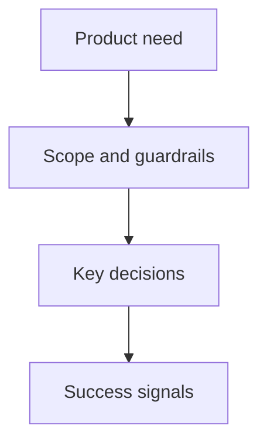

## prod_002_theming_platform_engine_packs - Theming platform (engine + packs)
> Date: 2026-08-21
> Status: Proposed
> Related request: `req_001_theming_capability_surface_flagship_identity_packs`
> Related backlog: (none yet)
> Related task: (none yet)
> Related architecture: (none yet)
> Reminder: Update status, linked refs, scope, decisions, success signals, and open questions when you edit this doc.
> Indicators reviewed: 2026-08-21 16:56:18

# Overview
- Turns Archeotech from a single fixed identity into a themeable-shell PLATFORM: a neutral glassmorphism BASE plus swappable, community-authorable identity PACKS (WH40K dataslate, Gundam-HUD, cyberdeck, later others). A pack reskins the presentation layer as deeply as feasible but never mutates the interaction contract — "everything visual can change; how it works stays put" (adr_026).
- For: the owner (deep, distinctive personalisation of a daily-driver shell) and the community (authoring/sharing packs on the same rails as widget plugins), and it doubles as the r/unixporn traction engine (item_042 / item_080).

# Goals
- A versioned theming capability surface a pack MAY override: token tree, type, shape language, component-style delegates, decorator/FX layers, motion, assets, optional lexicon, and pack-scoped settings (item_081).
- A reusable HUD framing kit (angular corners, brackets, reticle grids, mono micro-labels) that packs opt into, not on the neutral base (item_078).
- A flagship deep pack (WH40K Shadow Spears dataslate) bundled in-repo that dogfoods the whole surface (item_082).
- Theme packs distribute/install/enable/configure on the existing plugin rails — manifest tiers + minShellVersion, plugins.json index, Manager pane (item_021 / item_066 / item_065 / item_063).

# Non-goals
- Changing keybinds, information architecture, the <=2-keystroke rule, core config-key semantics, widget-mounting/state contracts, or component behaviour — packs may ADD settings but never rebind/rename/relocate CORE ones.
- Wallpaper-driven Material-You theming (deliberately declined — the trend the shell differentiates against; see item_042).
- A parallel extensibility stack — theming reuses the widget-plugin rails rather than inventing its own.

# Scope and guardrails
- In: the engine/capability surface, the skin/structure boundary, the versioned component-style contract (start conservative — tokens+shape+decorator+motion+assets+pack-settings first, component delegates for a curated set later), the HUD kit, the bundled flagship pack, and pack distribution/tiers on plugin rails.
- Out: the stable core (keybinds/IA/config semantics/behaviour/sandbox); non-theming features (dev-tooling plugin, testing harness, Hyprland, release plumbing); the shell-wide design-polish rollout (its own effort).

# Key product decisions
- Skin/structure boundary with a versioned public style contract gated by `minShellVersion` (adr_026).
- A theme pack IS a kind of plugin — same install/discovery/manifest rails as widgets, loaded via the adr_016 file:// + injected-appearance mechanism.
- Trust tiers (official/verified/community) gate injected-QML packs; the base theme is formalised as the reference pack.

# Success signals
- The neutral glass base and the WH40K pack are both selectable and swap the whole identity at runtime; tokens/component-styles/FX/motion cascade from the active pack; the HUD kit renders only where a pack opts in.
- A third-party can author a token/shape-only "personality" pack (item_051) and a deep pack without touching core behaviour, and install it by name through the Manager.

# References
- Product back-reference: (none yet)
- Task back-reference: (none yet)
- Architecture: `adr_026_theming_architecture_skin_structure_boundary_and_versioned_capability_surface`; builds on adr_004, adr_010, adr_016, adr_009, adr_022.
- Backlog: item_081 (engine), item_082 (flagship WH40K), item_078 (HUD kit), item_021 (distribution/tiers), item_066 (manifest), item_065 (install/index), item_063 (Manager pane), item_051 (personalities).
- Drivers: item_042 (ricing R&D), item_080 (traction/presentation); spec `docs/THEME_SPEC.md`.
