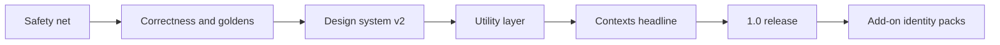

## prod_003_archeotech_1_0_after_the_2026_09_28_audit - Archeotech 1.0 after the 2026-09-28 audit
> Date: 2026-09-28
> Status: Settled
> Related request: `req_005_2026_09_28_audit_upgrade_program`
> Related backlog: `item_003_verify_vscode_colorcustomizations_regen_on_non_catppuccin_themes`
> Related task: `task_031_orchestrate_2026_09_28_audit_upgrade_program`
> Related architecture: (none yet)
> Reminder: Update status, linked refs, scope, decisions, success signals, and open questions when you edit this doc.
> Indicators reviewed: 2026-09-28 12:57:33

# Overview
A public, community-ready Quickshell desktop shell whose base identity is Corvus Dataslate (violet on obsidian, restrained, per STYLE_GUIDE), whose headline 1.0 feature is Contexts (one switch for project, AWS/SSO, kube, git identity, layout, accent and focus mode), and whose identity packs (Grimdark/Warhammer, cyberpunk, gundam, ...) ship as installable add-ons through community pack support. Built with a safe, verifiable AI workflow: isolated renders, golden matrix, guard hooks.

# Goals
- Development never touches the owner's live session; every visual change ships with an isolated before/after contact sheet across dark, light and packs.
- Correctness before polish: every audit-verified bug fixed and guarded by goldens or logic tests.
- A semantic, mode-aware design system where light themes are designed, not recoloured, and no pack chrome lives in core.
- Daily-utility parity with DMS/Noctalia/Caelestia (command-palette launcher, notifications v2) plus the developer layer no peer has (Contexts, dev radar, Claude Ask).
- Installable by a stranger on fresh Arch on MangoWC and Hyprland, with a versioned plugin API and URL-installable packs.

# Non-goals
- Built-in identity packs other than Base (Grimdark and future packs are add-ons).
- Angular and HUD as shipped packs (retired to test fixtures).
- Personal machine configuration (moved to road_002).
- A Go/C++ daemon rewrite, a plugin marketplace UI, or a greeter before 1.0.

# Scope and guardrails
- In: the req_005 program (items 101-129 plus carried-over items on task_031), sequenced by road_001 milestones 0.30 to 1.0.
- Out: personal machine config (road_002); built-in identity packs other than Base; new ideas not blocking an exit signal (scope freeze - they go to 1.1 or later).
- Guardrail: no shell code work before the 0.30 safety net; every visual change carries an isolated contact sheet.

# Key product decisions
- 2026-09-28 (adr_032): Corvus Dataslate base identity; identity packs as add-ons; Contexts as the 1.0 headline; Angular and HUD retired to test fixtures.
- The product brief prod_001 remains the long-lived shell brief; this brief records the post-audit direction to 1.0.

# Success signals
- Zero live-session touches by development tooling (guard hook log stays clean).
- Golden matrix green across themes x packs x modes x panel states, with AA contrast.
- Fix commits per delivered item below 3 (audit baseline: frequent re-tunes and 3 reverts).
- A stranger installs on fresh Arch and switches to a URL-installed add-on pack.

# References
- Product back-reference: `item_003_verify_vscode_colorcustomizations_regen_on_non_catppuccin_themes`
- Task back-reference: `task_031_orchestrate_2026_09_28_audit_upgrade_program`
