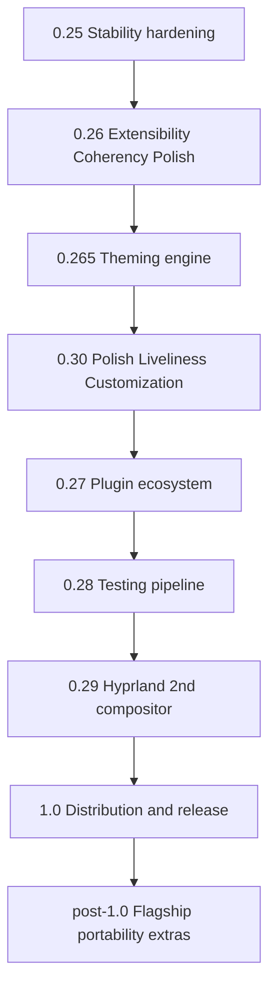

## road_001_archeotech_shell - Archeotech shell
> Date: 2026-08-20
> Status: Proposed
> Related product: `prod_001_archeotech_shell`
> Related request: `req_000_archeotech_shell_dotfiles`
> Reminder: Update status, milestone scope, linked refs, risks, and success signals when you edit this doc.
> Indicators reviewed: 2026-09-03 16:34:46

# AI Context
- Summary: Roadmap for Archeotech shell.
- Keywords: roadmap, milestones, versions, archeotech shell
- Use when: Planning or sequencing versions for Archeotech shell.
- Skip when: You need execution details for a single backlog item or task.

# Summary
Plan the path from first usable increment to stable release for archeotech shell. v1 bar (decided 2026-09-03): a public, community-ready release. Ordering: stability gates polish gates distribution. Top priorities: stability, aesthetics/identity, extensibility. The flagship theme pack and dev-workflow bundle ship post-1.0.

# Milestones
## 0.25 - Stability hardening
- `item_005_fix_dock_undock_freeze_wlroots_output_hotplug_on_mangowm_0_16`: Fix dock-undock freeze (wlroots output-hotplug) on mangowm 0.16
- `item_026_multi_monitor_compositor_utilities`: Multi-monitor & compositor utilities
- `item_011_decide_and_apply_lid_close_while_docked_suspend_behaviour`: Decide and apply lid-close-while-docked suspend behaviour
- `task_015_output_hotplug_auto_detect_tags_follow_monitor_gaming_mode_remaining`: output hotplug auto-detect + tags-follow-monitor + gaming mode
- `item_043_fix_dashboard_auto_close_right_after_boot`: Fix dashboard auto-close right after boot
- Goal: (user #1 priority) Rock-solid daily-driver fundamentals — clean dock/undock, resume, multi-monitor hotplug, no boot-time UI bugs — so all downstream v1 polish lands on a stable base.
- Scope: fix the dock-undock freeze (wlroots output-hotplug on mangowm 0.16), output-hotplug auto-detect + tags-follow-monitor, multi-monitor/compositor utilities, lid-close-while-docked suspend behaviour, and the dashboard auto-close-after-boot bug.
- Exit signal: A full dock/undock/resume/hotplug cycle across the work + home monitor sets never freezes or mis-tracks, and no panel/dashboard misbehaves right after boot.

## 0.26 - Widget Extensibility, Coherency & Core Polish
- `item_035_coherency_audit_slice_2_selector_unification_remaining`: Coherency audit Slice 2 - selector unification (remaining)
- `item_036_coherency_audit_slice_3_flat_mode_sweep`: Coherency audit Slice 3 - flat-mode sweep
- `item_037_coherency_audit_slice_4_dedup_inputs`: Coherency audit Slice 4 - dedup + inputs
- `item_038_coherency_audit_slice_5_one_offs_tokens`: Coherency audit Slice 5 - one-offs + tokens
- `item_044_workspace_indicators_3d_polish`: Workspace indicators 3D polish
- `item_045_edit_mode_stragglers_onto_3d_glass_theme`: Edit mode + stragglers onto 3D/glass theme
- `item_050_gradient_sheen_on_nested_cards_experiment`: Gradient sheen on nested cards experiment
- `item_039_glass_themed_system_tray_context_menu_tooltip`: Glass-themed system-tray context menu + tooltip
- `item_012_flat_glass_aesthetic_settings_toggle_full_rollout`: Flat <-> glass aesthetic Settings toggle full rollout
- `item_009_palette_crossfade_on_theme_apply`: Palette crossfade on theme apply
- `item_002_visual_pass_on_the_light_themes`: Visual pass on the light themes
- `item_004_check_widened_settings_panes_760_940_don_t_look_sparse`: Check widened Settings panes (760->940) don't look sparse
- `item_006_live_colour_preview_on_scroll_in_pickers`: Live colour preview on scroll in pickers
- `item_007_async_fade_in_on_wallpaper_thumbnails`: Async fade-in on wallpaper thumbnails
- `item_008_eager_warm_the_wallpapers_service_at_shell_startup`: Eager-warm the Wallpapers service at shell startup
- `item_010_move_thumbnail_cache_to_freedesktop_shared_path`: Move thumbnail cache to freedesktop shared path
- `item_046_dashboard_customizable_grid`: Dashboard customizable grid
- `item_047_dashboard_pinnable_projects`: Dashboard pinnable projects
- `item_048_dashboard_hero_rotating_quote`: Dashboard hero rotating quote
- `item_049_dashboard_customizable_system_notes_data_reliability`: Dashboard customizable System Notes + data reliability
- `item_016_launcher_keyboard_first_master_search`: Launcher keyboard-first master search
- `item_017_panel_keybinds_dismissal_consistency`: Panel keybinds / dismissal consistency
- `item_015_auto_hide_sides_in_fullscreen`: Auto-hide sides in fullscreen
- `item_018_lock_screen_customization_widgets_settings_pane`: Lock screen customization / widgets Settings pane
- `item_013_layout_loadouts_presets`: Layout loadouts / presets
- `item_062_desktop_widget_layer_sprint_21_chunk_3_deferred`: Desktop widget layer (Sprint 21 Chunk 3, deferred)
- `item_022_visual_builder_drag_and_drop_spatial_zone_representation`: Visual Builder drag-and-drop + spatial zone representation
- `item_064_holder_aware_panels_responsive_vertical_orientation_widgets`: Holder-aware panels + responsive vertical-orientation widgets
- `item_063_configschema_auto_forms_plugin_widget_manager_pane`: configSchema auto-forms + Plugin/Widget Manager pane
- `req_003_swappable_widget_faces_and_skins`: Swappable widget faces and skins
- `item_087_settings_deep_dive_search_display_modes_deep_linking`: Settings deep-dive (search / display-modes / deep-linking)
- Goal: Every widget/module per-instance configurable and swappable-in-look from a GUI, on a coherent, fully-audited glass/3D surface — removing the last need to hand-edit shell-config.json.
- Scope: configSchema-driven auto-forms + Plugin/Widget Manager, per-instance `{id,config}`, holder-aware panels + responsive vertical widgets, the visual-builder DnD, swappable widget faces/skins (req_003), a settings deep-dive (search/display-modes/deep-linking, item_087), plus the coherency-audit slices, 3D/glass rollout, picker feel, dashboard, and flat<->glass toggle.
- Exit signal: Widgets configure + change face from the manager pane, every surface passes the coherency audit, and the pickers/dashboard/launcher feel fluid; only drag-reorder polish remains open.

## 0.265 - Theming & Identity (engine)
- `item_081_theming_capability_surface_engine_token_tree_component_style_registry_decorator_fx_motion_hooks_pack_scoped_settings`: Theming capability surface (engine)
- `req_001_theming_capability_surface_flagship_identity_packs`: Theming capability surface & flagship identity packs
- `item_078_hud_framing_kit_angular_corners_corner_brackets_reticle_grids_mono_micro_labels`: HUD framing kit (angular corners, corner brackets, reticle grids, mono micro-labels)
- `item_091_accent_picker_for_all_theme_families_with_gtk_fallback`: Accent picker for all theme families (GTK fallback)
- Goal: Ship the themeable-platform capability surface (ENGINE) so a whole visual identity can swap as a pack on the neutral glass base (adr_026/027). The flagship pack itself ships post-1.0.
- Scope: the theming engine (token tree, component style-delegate registry, decorator/FX + motion hooks, pack-scoped settings); a reusable HUD framing kit that packs opt into; accent exposed for all families with GTK fallback (item_091). The WH40K/Grimdark flagship pack moves to the first post-1.0 drop.
- Exit signal: The neutral glass base is themeable end-to-end — tokens/component-styles/FX/motion cascade from an active pack, the HUD kit renders only where a pack opts in, and accent works across all families — with at least a stub pack proving the surface.

## 0.30 - Polish, Liveliness & Customization
- `req_002_motion_and_fluidity_system`: Motion and fluidity system
- `req_004_creative_applets_and_canvas_visualizations`: Creative applets and canvas visualizations
- `item_088_bar_container_style_variants_continuous_pills_framed_floating_per_side`: Bar container style variants (continuous/pills/framed/floating, per side)
- `item_079_cava_audio_visualizer_element_bar_dashboard_lock_spectrum_opt_in`: cava audio-visualizer element (bar/dashboard/lock spectrum, opt-in)
- `item_085_idle_and_screensaver_mode`: Idle and screensaver mode
- `item_086_nicer_boot_menu_aesthetics_grub_theme`: Nicer boot menu aesthetics (GRUB theme)
- Goal: (user #2 priority) Make the shell feel premium and alive at launch — the research-derived motion, creative applets, per-side bar chrome, and ambient liveliness that set two setups wildly apart. Sourced from ANALYSIS section 20.
- Scope: the motion & fluidity system (interruptible morph, motion personalities + live preview, micro-interactions + UI sound, entrance/ambient — req_002); creative applets + Canvas hero-viz (req_004); per-side bar container styles (continuous/pills/framed/floating — item_088); the cava audio visualizer; an idle/screensaver mode; and a themed boot menu.
- Exit signal: Panels morph fluidly and interruptibly, the bar can switch between continuous/pills/framed/floating per side, motion is user-tunable with live preview, and the shell reads lively/warm rather than flat/cold next to peer rices.

## 0.27 - Extensibility & Plugin Ecosystem
- `item_065_archeotech_plugin_install_mechanism_plugins_json_index`: archeotech plugin install mechanism + plugins.json index
- `item_066_plugin_manifest_schema_official_verified_minshellversion_deps`: Plugin manifest schema (official/verified/minShellVersion/deps)
- `item_020_core_plugin_optional_extraction`: Core -> plugin / optional extraction
- `item_019_theme_applier_plugins_refactor`: Theme-applier plugins refactor
- `item_021_theme_packs_official_community`: Theme Packs (official + community)
- Goal: A working, community-usable plugin + theme-pack ecosystem — install by name from an index, with a manifest/trust contract — so others can extend the shell (user #3 priority). The dev-workflow bundle itself moves post-1.0.
- Scope: `archeotech plugin install <name>` git-clone mechanism + repo-hosted plugins.json index, plugin manifest fields (official/verified/minShellVersion/dependencies), core->plugin/optional extraction, theme-applier plugin refactor, and the official+community Theme Packs distribution model — all enabled/configured via the Plugin Manager.
- Exit signal: A stranger can install a plugin or theme pack by name from the index and enable/configure it through the manager; niche/personal tooling lives outside core.

## 0.28 - Testing & Visual-Verification Pipeline
- `item_067_headless_render_harness_shot_sh_qs_ipc_state_driving`: Headless render harness (shot.sh + qs-ipc state-driving)
- `item_068_visual_regression_vs_goldens_qml_logic_tests_arch_container_ci`: Visual-regression vs goldens + QML logic tests + Arch-container CI
- `item_069_ai_persona_testers_verify_before_done_loop`: AI persona-testers + verify-before-done loop
- `item_001_test_the_auto_day_night_schedule_end_to_end`: Test the auto day/night schedule end-to-end
- `item_003_verify_vscode_colorcustomizations_regen_on_non_catppuccin_themes`: Verify VSCode colorCustomizations regen on non-Catppuccin themes
- Goal: Ship and verify features faster and with higher quality before going public, cutting the "claimed done but wrong" cycle and standing up AI persona-testers.
- Scope: headless render-to-PNG visual verification (safety-fixed shot.sh), temporal/burst capture for motion correctness, qs-ipc state-driving, ImageMagick visual-regression vs goldens, QML logic tests, CI extension in an Arch container, UXAgent-style AI persona-testers, and a verify-before-done loop.
- Exit signal: A visual change can be driven into state, rendered headless, diffed against a golden, and shown inline before being called done; the harness auto-generates the 1.0 README screenshots.

## 0.29 - Hyprland as 2nd Compositor
- `item_070_compositorservice_facade_mango_hyprland_service_extraction`: CompositorService facade + Mango/Hyprland service extraction
- `item_071_hyprland_config_port_dual_sddm_session_reload_parity`: Hyprland config port + dual SDDM session + reload parity
- `item_084_migrate_hyprland_config_to_lua_window_rules_per_app_opacity_floating_pip`: Migrate Hyprland config to Lua (window rules, per-app opacity, floating PiP)
- `item_072_docs_compositor_support_md_for_both_compositors`: docs COMPOSITOR_SUPPORT.md for both compositors
- Goal: Run the shell first-class on Hyprland as well as MangoWC, selectable at login, realizing the CompositorService abstraction (vision pillar 4).
- Scope: a CompositorService facade with a stable API, MangoService + HyprlandService behind it, routing all mmsg sites through the facade, a Hyprland config port (now Lua — keybinds/window rules/monitor/blur/per-app opacity/floating PiP), a dual SDDM session, and reload parity.
- Exit signal: Logging into the Hyprland session renders the shell with tracking workspaces, working panels/OSD/blur, and reload parity; docs/COMPOSITOR_SUPPORT.md covers both compositors.

## 1.0 - Distribution & v1.0 Release
- `item_073_hardcoded_path_audit_zero_home_corvus`: Hardcoded-path audit (zero /home/corvus)
- `item_074_install_sh_rewrite_install_packages_sh_required_vs_optional`: install.sh rewrite + install-packages.sh (required vs optional)
- `item_075_scripted_per_variant_theme_symlinks`: Scripted per-variant theme symlinks
- `item_076_api_install_contributing_docs`: API + INSTALL + CONTRIBUTING docs
- `item_077_readme_screenshots_demo_gif_v1_0_0_tag`: README screenshots + demo GIF + v1.0.0 tag
- `item_034_portability_machine_profiles`: Portability & machine profiles
- `item_040_demo_onboarding_mode`: Demo / onboarding mode
- Goal: (v1 bar = public, community-ready) Installable by a stranger on fresh Arch with zero hardcoded paths, documented APIs, and a community that can publish plugins/themes.
- Scope: hardcoded-path audit (zero /home/corvus), install-packages.sh (required vs optional), rewritten install.sh (backup/stow/verify/first-run), scripted per-variant theme symlinks, INSTALL/PLUGIN_API/CONTRIBUTING + finalized MODULE/WIDGET/THEME/PANEL API docs, README screenshots + demo GIF (auto-generated via the 0.28 harness), portability/machine profiles, demo/onboarding mode, and the v1.0.0 tag with GitHub metadata.
- Exit signal: A fresh-Arch install by a stranger produces a working shell and the v1.0.0 tag is published with docs, screenshots, and a plugin/theme contribution path.

## post-1.0 - Depth Sprints (flagship, portability & extras)
- `item_082_flagship_theme_pack_1_wh40k_shadow_spears_dataslate`: Flagship theme pack #1 (Grimdark) - first post-1.0 drop
- `item_083_theming_engine_ornament_asset_overlay_fx_pack_font_hook_flagship_gap`: Theming engine: ornament asset-overlay FX + pack font hook (flagship gap)
- `item_089_niri_and_sway_compositor_services_post_v1_0`: Niri and Sway compositor services
- `item_090_zen_browser_dynamic_chrome_theming_palette_follow_no_restart`: Zen browser dynamic chrome theming (palette-follow, no restart)
- `item_023_dev_workflow_bar_widgets_docker_keyboardlayout_capslock`: Dev-workflow bar widgets (Docker/KeyboardLayout/CapsLock)
- `item_024_dev_workflow_rofi_scripts_aws_terraform_vscode_monitor`: Dev-workflow rofi scripts (AWS/Terraform/VSCode/monitor)
- `item_051_named_theme_personalities_as_glass_base_variants`: Named theme personalities as glass-base variants
- `item_033_per_workspace_wallpapers`: Per-workspace wallpapers
- `item_025_clipboard_improvements`: Clipboard improvements
- `item_027_named_scratchpads`: Named scratchpads
- `item_028_tool_discovery_system`: Tool discovery system
- `item_029_quick_tools_context_menu_super_x`: Quick tools context menu (Super+X)
- `item_030_screenshot_recording_improvements`: Screenshot & recording improvements
- `item_031_kitty_session_presets`: Kitty session presets
- `item_032_ssh_quick_connect_super_ctrl_s`: SSH quick connect (Super+Ctrl+S)
- `item_041_r_d_missing_common_niche_shell_os_features`: R&D: missing common + niche shell/OS features
- `item_042_r_d_r_unixporn_ricing_inspiration_pass`: R&D: r/unixporn + ricing inspiration pass
- `item_052_someday_terminal_editor_tooling`: Someday: terminal & editor tooling
- `item_053_someday_developer_tooling`: Someday: developer tooling
- `item_054_someday_browser_apps`: Someday: browser & apps
- `item_055_someday_communication_productivity`: Someday: communication & productivity
- `item_056_someday_music_media`: Someday: music & media
- `item_057_someday_visual_flair`: Someday: visual flair
- `item_058_someday_tools_to_evaluate`: Someday: tools to evaluate
- `item_059_someday_reading_cs_books_setup`: Someday: reading & CS books setup
- `item_060_someday_color_extraction_tools_evaluation`: Someday: color extraction tools evaluation
- `item_061_someday_small_quick_win_installs`: Someday: small quick-win installs
- Goal: Extend identity, reach and flair beyond the release, once the engine + facade + Hyprland have proven the patterns.
- Scope: the flagship Grimdark theme pack (first big post-1.0 drop; needs IP-safe rename) + the engine ornament/FX + font-hook gap it exposes; NiriService/SwayService behind the facade; dynamic Zen chrome theming; the dev-workflow plugin bundle; and the deferred utilities/someday/R&D backlog.
- Exit signal: The flagship pack ships and dogfoods the engine, the shell also runs on Niri/Sway, and optional persona/dev/utility extras ship as plugins without touching core.

# Sequencing
- Deliver milestones in ascending version order unless dependencies force a documented exception.
- Keep each increment independently reviewable and linked to concrete workflow docs.

# Risks
- Long-term scope can drift unless every milestone keeps a clear exit signal.
- Version labels are planning targets, not release promises.

# References
- Product brief(s): `prod_001_archeotech_shell`
- Request(s): `req_000_archeotech_shell_dotfiles`
- Backlog item(s): (none yet)
- Task(s): (none yet)
