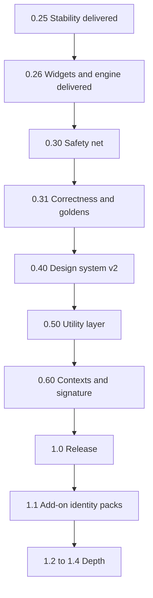

## road_001_archeotech_shell - Archeotech shell
> Date: 2026-08-20
> Status: Proposed
> Related product: `prod_001_archeotech_shell`
> Related request: `req_005_2026_09_28_audit_upgrade_program`
> Reminder: Update status, milestone scope, linked refs, risks, and success signals when you edit this doc.
> Indicators reviewed: 2026-09-29 11:01:56

# AI Context
- Summary: Roadmap for the Archeotech shell, re-sequenced after the 2026-09-28 five-area audit (safety net, correctness, design system v2, utility layer, Contexts, 1.0).
- Keywords: roadmap, milestones, versions, archeotech shell, audit, contexts, add-on packs
- Use when: Planning or sequencing versions for the Archeotech shell.
- Skip when: You need execution details for a single backlog item or task; personal dotfiles work lives on road_002.

# Summary
Plan the path to a public, community-ready 1.0 (v1 bar decided 2026-09-03), re-sequenced after the 2026-09-28 audit (.claude/audits/2026-09-28/). Ordering: safety net, then correctness, then design system, then utility and headline features, then distribution. Owner decisions 2026-09-28: Contexts is the 1.0 headline; Corvus Dataslate is the base identity; identity packs (Grimdark, cyberpunk, gundam) ship as add-ons after 1.0; Angular and HUD were test-only packs; personal items moved to road_002. Scope freeze: new ideas go to 1.1 or later unless they block an exit signal.

```mermaid
flowchart TD
  A[0.25 Stability delivered]
  B[0.26 Widgets and engine delivered]
  C[0.30 Safety net]
  D[0.31 Correctness and goldens]
  E[0.40 Design system v2]
  F[0.50 Utility layer]
  G[0.60 Contexts and signature]
  H[1.0 Release]
  I[1.1 Add-on identity packs]
  J[1.2 to 1.4 Depth]
  A --> B --> C --> D --> E --> F --> G --> H --> I --> J
```

# Milestones
## 0.25 - Stability hardening (delivered)
- `item_005_fix_dock_undock_freeze_wlroots_output_hotplug_on_mangowm_0_16`: Fix dock-undock freeze (wlroots output-hotplug) on mangowm 0.16
- `item_026_multi_monitor_compositor_utilities`: Multi-monitor & compositor utilities
- `item_011_decide_and_apply_lid_close_while_docked_suspend_behaviour`: Decide and apply lid-close-while-docked suspend behaviour
- `task_015_output_hotplug_auto_detect_tags_follow_monitor_gaming_mode_remaining`: output hotplug auto-detect + tags-follow-monitor + gaming mode (remaining)
- `item_043_fix_dashboard_auto_close_right_after_boot`: Fix dashboard auto-close right after boot
- Goal: Rock-solid dock/undock, resume, hotplug and boot behaviour.
- Scope: Delivered before the 2026-09-28 audit.
- Exit signal: Met: dock/undock/resume/hotplug cycles clean.

## 0.26 - Widgets, coherency and theming engine (delivered)
- `item_035_coherency_audit_slice_2_selector_unification_remaining`: Coherency audit Slice 2 - selector unification (remaining)
- `item_036_coherency_audit_slice_3_flat_mode_sweep`: Coherency audit Slice 3 - flat-mode sweep
- `item_037_coherency_audit_slice_4_dedup_inputs`: Coherency audit Slice 4 - dedup + inputs
- `item_038_coherency_audit_slice_5_one_offs_tokens`: Coherency audit Slice 5 - one-offs + tokens
- `item_044_workspace_indicators_3d_polish`: Workspace indicators 3D polish
- `item_050_gradient_sheen_on_nested_cards_experiment`: Gradient sheen on nested cards experiment
- `item_012_flat_glass_aesthetic_settings_toggle_full_rollout`: Flat <-> glass aesthetic Settings toggle full rollout
- `item_008_eager_warm_the_wallpapers_service_at_shell_startup`: Eager-warm the Wallpapers service at shell startup
- `item_048_dashboard_hero_rotating_quote`: Dashboard hero rotating quote
- `item_016_launcher_keyboard_first_master_search`: Launcher keyboard-first master search
- `item_015_auto_hide_sides_in_fullscreen`: Auto-hide sides in fullscreen
- `item_022_visual_builder_drag_and_drop_spatial_zone_representation`: Visual Builder drag-and-drop + spatial zone representation
- `item_063_configschema_auto_forms_plugin_widget_manager_pane`: configSchema auto-forms + Plugin/Widget Manager pane
- `req_003_swappable_widget_faces_and_skins`: Swappable widget faces and skins
- `item_081_theming_capability_surface_engine_token_tree_component_style_registry_decorator_fx_motion_hooks_pack_scoped_settings`: Theming capability surface (engine): token tree, component style registry, decorator/FX + motion hooks, pack-scoped settings
- `item_066_plugin_manifest_schema_official_verified_minshellversion_deps`: Plugin manifest schema (official/verified/minShellVersion/deps)
- `item_067_headless_render_harness_shot_sh_qs_ipc_state_driving`: Headless render harness (shot.sh + qs-ipc state-driving)
- `item_070_compositorservice_facade_mango_hyprland_service_extraction`: CompositorService facade + Mango/Hyprland service extraction
- `item_071_hyprland_config_port_dual_sddm_session_reload_parity`: Hyprland config port + dual SDDM session + reload parity
- `item_073_hardcoded_path_audit_zero_home_corvus`: Hardcoded-path audit (zero /home/corvus)
- `item_074_install_sh_rewrite_install_packages_sh_required_vs_optional`: install.sh rewrite + install-packages.sh (required vs optional)
- Goal: Per-instance widget config, swappable faces, coherency audit slices, theming engine core, render harness, compositor facade, install rewrite.
- Scope: Everything delivered from the former 0.26/0.265/0.27/0.28/0.29/1.0 milestones up to 2026-09-28; open items from those milestones were re-sequenced below after the audit.
- Exit signal: Met for the delivered scope; the 2026-09-28 audit found correctness bugs under it (see 0.31).

## 0.30 - Safety net
- `item_101_isolate_shot_sh_fully_and_render_any_worktree`: Isolate shot.sh fully and render any worktree
- `item_102_claude_code_project_tooling_guard_hooks_qt6_lint_skills_and_reviewer_agents`: Claude Code project tooling: guard hooks, Qt6 lint, skills and reviewer agents
- `item_103_live_bar_on_a_pinned_worktree_with_a_promote_script`: Live bar on a pinned worktree with a promote script
- `item_104_docs_and_repo_hygiene_after_the_audit`: Docs and repo hygiene after the audit
- Goal: AI-assisted development can never touch the owner's live session, and every change can be rendered and verified in isolation.
- Scope: Isolated shot.sh with worktree rendering, guard hooks plus Qt6 lint plus skills and reviewer agents, live bar on a pinned worktree, docs hygiene.
- Exit signal: A worktree edit renders headless with the live bar and real HOME untouched (mtime check), and the guard hook blocks every forbidden live-session command.

## 0.31 - Correctness sweep and golden matrix
- `item_068_visual_regression_vs_goldens_qml_logic_tests_arch_container_ci`: Visual-regression vs goldens + QML logic tests + Arch-container CI
- `item_105_service_command_runner_queue_and_startup_gating`: Service command runner queue and startup gating
- `item_106_bar_and_strip_widget_instantiation_fixes`: Bar and strip widget instantiation fixes
- `item_107_no_fake_toggles_sweep_controls_bound_to_real_state`: No-fake-toggles sweep: controls bound to real state
- `item_108_toast_osd_and_network_service_hardening`: Toast, OSD and network service hardening
- `item_109_visual_defects_found_in_the_audit_render_matrix`: Visual defects found in the audit render matrix
- `item_049_dashboard_customizable_system_notes_data_reliability`: Dashboard customizable System Notes + data reliability
- Goal: Fix every bug the audit verified and lock the result in with goldens.
- Scope: Service command queue and startup gating, widget instantiation fixes, no-fake-toggles sweep, toast/OSD/network hardening, visual defects from the render matrix, dashboard data reliability, golden matrix with image diff, contrast checks and Arch-container CI.
- Exit signal: scripts/golden.sh passes across themes x packs x modes x panel states and no verified audit bug remains open.

## 0.40 - Design system v2
- `item_110_semantic_token_layer_with_contrast_floor_and_spacing_type_scales`: Semantic token layer with contrast floor and spacing/type scales
- `item_111_designed_light_themes_with_their_own_surface_recipe`: Designed light themes with their own surface recipe
- `item_112_surface_recipes_and_pack_chrome_out_of_core_primitives`: Surface recipes and pack chrome out of core primitives
- `item_113_primitive_library_completion_with_focus_and_disabled_states`: Primitive library completion with focus and disabled states
- `item_114_unified_motion_presets_with_reduced_motion_and_animation_scale`: Unified motion presets with reduced motion and animation scale
- `item_115_corvus_dataslate_base_identity`: Corvus Dataslate base identity
- `item_116_glass_material_decision_real_blur_or_satin`: Glass material decision: real blur or satin
- `item_117_retire_angular_and_hud_test_packs_to_test_fixtures`: Retire Angular and HUD test packs to test fixtures
- `item_039_glass_themed_system_tray_context_menu_tooltip`: Glass-themed system-tray context menu + tooltip
- `item_130_edit_mode_design_review_and_audit`: Edit mode design review and audit
- `item_045_edit_mode_stragglers_onto_3d_glass_theme`: Edit mode + stragglers onto 3D/glass theme
- `item_017_panel_keybinds_dismissal_consistency`: Panel keybinds / dismissal consistency
- `item_091_accent_picker_for_all_theme_families_with_gtk_fallback`: Accent picker for all theme families with GTK fallback
- `item_006_live_colour_preview_on_scroll_in_pickers`: Live colour preview on scroll in pickers
- `item_007_async_fade_in_on_wallpaper_thumbnails`: Async fade-in on wallpaper thumbnails
- `item_009_palette_crossfade_on_theme_apply`: Palette crossfade on theme apply
- Goal: A semantic, mode-aware design system with designed light themes, pack chrome out of core, and the Corvus Dataslate base identity.
- Scope: Semantic tokens with a contrast floor, light surface recipe, surface recipes and style delegates, primitive completion with focus/disabled states, unified motion presets, glass decision, retire test packs, plus tray menu, edit mode, dismissal consistency, accent for all families and picker feel.
- Exit signal: No hex literal outside tokens, every golden passes AA in glass/flat/light, no pack-specific branch in core, owner signs off on the base contact sheet.

## 0.50 - Daily utility layer
- `item_118_launcher_command_palette_with_providers`: Launcher command palette with providers
- `item_119_notifications_v2_actions_images_grouping_history`: Notifications v2: actions, images, grouping, history
- `item_120_state_driven_osd_generic_panel_ipc_and_keybind_cheatsheet`: State-driven OSD, generic panel IPC and keybind cheatsheet
- `item_121_native_quickshell_networking_and_bluetooth_services`: Native Quickshell Networking and Bluetooth services
- Goal: Parity with DMS/Noctalia/Caelestia on the everyday layer.
- Scope: Launcher command palette with providers, notifications v2, state-driven OSD plus generic panel IPC plus keybind cheatsheet, native Networking and Bluetooth.
- Exit signal: Four rofi scripts retired; notifications support actions, history and grouping; any panel opens by IPC.

## 0.60 - Contexts and signature features
- `item_122_contexts_one_switch_for_project_cloud_and_workspace_state`: Contexts: one switch for project, cloud and workspace state
- `item_123_dev_radar_widgets_aws_sso_pill_and_git_pr_ci_radar`: Dev radar widgets: AWS SSO pill and git/PR/CI radar
- `item_124_claude_ask_panel`: Claude Ask panel
- `item_125_signature_motion_panels_grow_from_the_bar_interruptible`: Signature motion: panels grow from the bar, interruptible
- `item_013_layout_loadouts_presets`: Layout loadouts / presets
- Goal: The 1.0 headline: features no peer shell has, built for the owner's dev and cloud workflow.
- Scope: Contexts switcher (project, AWS/SSO, kube, git identity, layout loadout, accent, focus mode), AWS SSO pill and git/PR/CI radar, Claude Ask panel, interruptible panel-from-bar motion.
- Exit signal: Switching context applies every facet and a prod context turns the accent to danger; panel morph reverses mid-flight without a jump.

## 1.0 - Distribution and release
- `item_126_versioned_plugin_api_exposing_shell_services`: Versioned plugin API exposing shell services
- `item_127_portability_hardening_for_strangers_machines`: Portability hardening for strangers' machines
- `item_128_fresh_arch_install_test_and_hyprland_service_parity`: Fresh-Arch install test and Hyprland service parity
- `item_065_archeotech_plugin_install_mechanism_plugins_json_index`: archeotech plugin install mechanism + plugins.json index
- `item_021_theme_packs_official_community`: Theme Packs (official + community)
- `item_075_scripted_per_variant_theme_symlinks`: Scripted per-variant theme symlinks
- `item_076_api_install_contributing_docs`: API + INSTALL + CONTRIBUTING docs
- `item_072_docs_compositor_support_md_for_both_compositors`: docs COMPOSITOR_SUPPORT.md for both compositors
- `item_077_readme_screenshots_demo_gif_v1_0_0_tag`: README screenshots + demo GIF + v1.0.0 tag
- `item_040_demo_onboarding_mode`: Demo / onboarding mode
- `item_010_move_thumbnail_cache_to_freedesktop_shared_path`: Move thumbnail cache to freedesktop shared path
- `item_003_verify_vscode_colorcustomizations_regen_on_non_catppuccin_themes`: Verify VSCode colorCustomizations regen on non-Catppuccin themes
- Goal: Installable by a stranger on fresh Arch, with a plugin API and URL-installable add-on packs.
- Scope: Versioned plugin API exposing services, portability hardening, fresh-Arch install test plus Hyprland parity, pack/plugin install by URL, community pack support, docs, screenshots and demo GIF from the goldens, first-run onboarding, v1.0.0 tag.
- Exit signal: The scripted fresh-Arch install passes the goldens on MangoWC and Hyprland and a third-party pack installs from a URL and switches live.

## 1.1 - Identity packs as add-ons
- `req_001_theming_capability_surface_flagship_identity_packs`: Theming capability surface & flagship identity packs
- `item_082_flagship_theme_pack_1_wh40k_shadow_spears_dataslate`: Flagship theme pack #1: WH40K Shadow Spears dataslate
- `item_083_theming_engine_ornament_asset_overlay_fx_pack_font_hook_flagship_gap`: Theming engine: ornament asset-overlay FX + pack font hook (flagship gap)
- `item_078_hud_framing_kit_angular_corners_corner_brackets_reticle_grids_mono_micro_labels`: HUD framing kit (angular corners, corner brackets, reticle grids, mono micro-labels)
- `item_051_named_theme_personalities_as_glass_base_variants`: Named theme personalities as glass-base variants
- `item_129_additional_add_on_identity_packs_cyberpunk_and_gundam`: Additional add-on identity packs: cyberpunk and gundam
- Goal: Grimdark (Warhammer), cyberpunk and gundam ship as installable add-on packs on the Corvus Dataslate base.
- Scope: Flagship Grimdark pack moved fully into pack files, ornament/font engine hooks, HUD framing kit as an opt-in engine capability, named personalities, further add-on packs.
- Exit signal: Each pack installs from its own repo URL and switches live with no core changes.

## 1.2 - Motion depth and bar chrome
- `req_002_motion_and_fluidity_system`: Motion and fluidity system
- `item_088_bar_container_style_variants_continuous_pills_framed_floating_per_side`: Bar container style variants continuous pills framed floating per side
- Goal: The rest of the motion system after the 0.60 signature morph, and per-side bar container styles.
- Scope: Motion personalities with live preview, micro-interactions, entrance/ambient motion; continuous/pills/framed/floating bar containers.
- Exit signal: Motion is user-tunable with live preview and each side can switch container style.

## 1.3 - Builder depth
- `item_096_visual_builder_applet_grouping_drop_onto_group_zone_merge_into_combined_pill`: Visual Builder applet grouping (drop-onto-group-zone merge into combined pill)
- `item_098_custom_pill_containers_arbitrary_n_separators_containers_per_side_with_chosen_widgets`: Custom pill containers — arbitrary N separators/containers per side with chosen widgets
- `item_046_dashboard_customizable_grid`: Dashboard customizable grid
- `item_047_dashboard_pinnable_projects`: Dashboard pinnable projects
- `item_062_desktop_widget_layer_sprint_21_chunk_3_deferred`: Desktop widget layer (Sprint 21 Chunk 3, deferred)
- `item_087_settings_deep_dive_search_display_modes_deep_linking`: Settings deep-dive search display-modes deep-linking
- `item_064_holder_aware_panels_responsive_vertical_orientation_widgets`: Holder-aware panels + responsive vertical-orientation widgets
- Goal: Deeper layout and dashboard customisation.
- Scope: Applet grouping, N containers per side, dashboard grid and pinnable projects, desktop widget layer, settings deep-dive, holder-aware vertical widgets.
- Exit signal: Every layout feature is reachable from the builder without editing JSON.

## 1.4 - Applets and ambient
- `req_004_creative_applets_and_canvas_visualizations`: Creative applets and canvas visualizations
- `item_079_cava_audio_visualizer_element_bar_dashboard_lock_spectrum_opt_in`: cava audio-visualizer element (bar/dashboard/lock spectrum, opt-in)
- `item_085_idle_and_screensaver_mode`: Idle and screensaver mode
- `item_018_lock_screen_customization_widgets_settings_pane`: Lock screen customization / widgets Settings pane
- `item_030_screenshot_recording_improvements`: Screenshot & recording improvements
- `item_033_per_workspace_wallpapers`: Per-workspace wallpapers
- `item_023_dev_workflow_bar_widgets_docker_keyboardlayout_capslock`: Dev-workflow bar widgets (Docker/KeyboardLayout/CapsLock)
- Goal: Creative applets and ambient liveliness.
- Scope: Canvas applets, cava visualizer, idle/screensaver, lock-screen customisation, screenshot/recording panel, per-workspace wallpapers, dev bar widgets as plugins.
- Exit signal: At least two applets and the idle mode ship as opt-in plugins.

## 1.5 - Later (unscheduled)
- `item_019_theme_applier_plugins_refactor`: Theme-applier plugins refactor
- `item_020_core_plugin_optional_extraction`: Core -> plugin / optional extraction
- `item_084_migrate_hyprland_config_to_lua_window_rules_per_app_opacity_floating_pip`: Migrate Hyprland config to Lua (window rules, per-app opacity, floating PiP)
- `item_089_niri_and_sway_compositor_services_post_v1_0`: Niri and Sway compositor services post v1_0
- `item_090_zen_browser_dynamic_chrome_theming_palette_follow_no_restart`: Zen browser dynamic chrome theming palette follow no restart
- `item_092_author_overview_mermaid_diagrams_for_remaining_adrs`: Author overview mermaid diagrams for remaining ADRs
- Goal: Refactors and reach that are not needed for the above.
- Scope: Theme-applier plugins refactor, core-to-plugin extraction, Hyprland Lua config, Niri/Sway services, Zen chrome theming, remaining ADR diagrams.
- Exit signal: Picked up only when a later milestone depends on it.

# Sequencing
- Deliver milestones in ascending version order unless dependencies force a documented exception.
- 0.30 gates everything: no shell code work before isolated rendering and guard hooks exist.
- Within a milestone, run High-priority items first and parallelise independent items in separate worktrees.
- Keep each increment independently reviewable, verified with an isolated contact sheet, and linked to concrete workflow docs.

# Risks
- Polish churn: about half of past commits were look-and-feel iteration; design work waits for 0.40 and must land through tokens and goldens.
- Scope creep: items 087-100 arrived while about 20 closed; the scope freeze above applies.
- Contexts in 1.0 adds about 3 weeks; if 1.0 slips, Contexts is the first candidate to move to 1.1.
- Version labels are planning targets, not release promises.

# References
- Product brief(s): `prod_001_archeotech_shell`, `prod_003_archeotech_1_0_after_the_2026_09_28_audit`
- Request(s): `req_005_2026_09_28_audit_upgrade_program`, `req_000_archeotech_shell_dotfiles`
- Backlog item(s): see milestones
- Task(s): `task_031_orchestrate_2026_09_28_audit_upgrade_program`
- Evidence: .claude/audits/2026-09-28/
