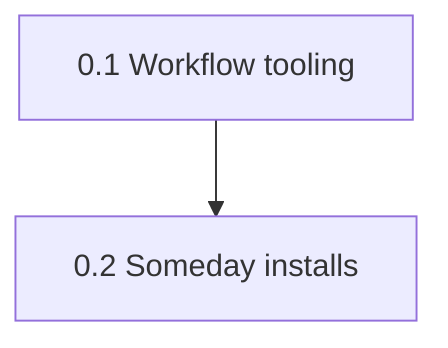

## road_002_dotfiles_machine_config - Dotfiles machine config
> Date: 2026-09-28
> Status: Proposed
> Related product: (none yet)
> Related request: `req_000_archeotech_shell_dotfiles`
> Reminder: Update status, milestone scope, linked refs, risks, and success signals when you edit this doc.

# AI Context
- Summary: Personal machine configuration (compositor config, rofi/kitty/ssh tooling, install profiles, someday installs) split out of the shell roadmap on 2026-09-28.
- Keywords: roadmap, dotfiles, machine config, personal, rofi, kitty, install profiles
- Use when: Planning personal dotfiles work that does not ship in the public archeotech shell.
- Skip when: Working on the shell itself; see road_001.

# Summary
Personal machine configuration for the owner's Arch laptop, kept separate from the public shell roadmap (road_001) per the 2026-09-28 audit decision. None of this blocks the shell 1.0; items here may later become shell plugins if they prove generally useful.

# Milestones
## 0.1 - Workflow tooling
- `item_024_dev_workflow_rofi_scripts_aws_terraform_vscode_monitor`: Dev-workflow rofi scripts (AWS/Terraform/VSCode/monitor)
- `item_027_named_scratchpads`: Named scratchpads
- `item_028_tool_discovery_system`: Tool discovery system
- `item_031_kitty_session_presets`: Kitty session presets
- `item_034_portability_machine_profiles`: Portability & machine profiles
- Goal: Personal workflow helpers the shell does not own: rofi scripts, scratchpads, kitty sessions, cheatsheets, install profiles.
- Scope: Items moved from road_001 on 2026-09-28. AWS/SSO status moved to the shell as item_123; clipboard, quick tools and SSH moved to the shell launcher (item_118).
- Exit signal: Each helper works from a fresh stow of this repo on the owner's machine.

## 0.2 - Someday installs and evaluations
- `item_052_someday_terminal_editor_tooling`: Someday: terminal & editor tooling
- `item_053_someday_developer_tooling`: Someday: developer tooling
- `item_054_someday_browser_apps`: Someday: browser & apps
- `item_055_someday_communication_productivity`: Someday: communication & productivity
- `item_056_someday_music_media`: Someday: music & media
- `item_057_someday_visual_flair`: Someday: visual flair
- `item_058_someday_tools_to_evaluate`: Someday: tools to evaluate
- `item_059_someday_reading_cs_books_setup`: Someday: reading & CS books setup
- `item_060_someday_color_extraction_tools_evaluation`: Someday: color extraction tools evaluation
- `item_061_someday_small_quick_win_installs`: Someday: small quick-win installs
- `item_086_nicer_boot_menu_aesthetics_grub_theme`: Nicer boot menu aesthetics GRUB theme
- Goal: Tool evaluations and quick-win installs, plus the GRUB theme.
- Scope: Unscheduled; pick up opportunistically.
- Exit signal: Each item is either installed and documented in docs/PACKAGES.md or closed as not wanted.

# Sequencing
- Independent of road_001; never blocks the shell release.

# Risks
- Personal items creeping back into the shell roadmap; keep shell-facing features on road_001.

# References
- Product brief(s): (none yet)
- Request(s): `req_000_archeotech_shell_dotfiles`
- Backlog item(s): see milestones
- Task(s): (none yet)
